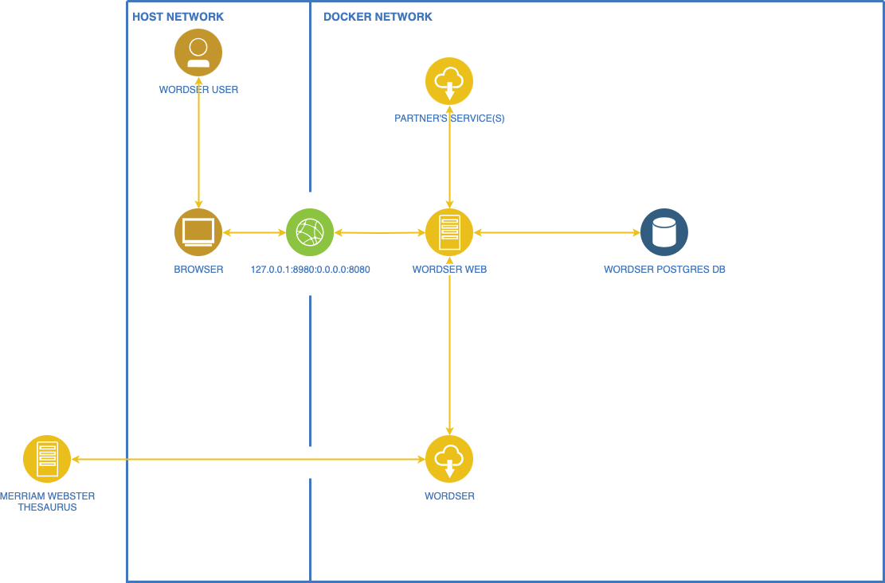

# Wordser
Class Project for Oregon State University Computer Science 361 - Software Engineering I

The application consists of two components:

1. Wordser Web: A golang web app for text analysis that serves html.
2. Wordser Service: A rust service that provides text analysis features such as:  
    a. synonyms for a word using MERRIAM-WEBSTER'S COLLEGIATE® THESAURUS API  
    b. text summarization, sentiment analysis, keyword extraction, and token unmasking using this wonderful rust crate: https://github.com/guillaume-be/rust-bert  

## Getting Started

### Prerequisites

1. Ensure that you have installed docker and `docker-compose`: https://docs.docker.com/compose/install/#scenario-one-install-docker-desktop  
2. Ensure that you have `Make`(developed with GNU Make) installed: https://www.gnu.org/software/make/. If you are on MacOS it is probably already installed.  
3. Ensure that you have `openssl` installed: https://www.openssl.org/. If you are on MacOS it is probably already installed.
4. In the wordser directory, make a file named `.env`, copy the contents of `.env-example` into `.env`, and set the value for your [MERRIAM-WEBSTER'S COLLEGIATE® THESAURUS API](https://dictionaryapi.com/products/api-collegiate-thesaurus) key.

### Using Wordser

1. From the project root directory run:  
```
make up
```

2. Go to http://localhost:8980/login and login as admin/admin for quick testing or Go to http://localhost:8980/signup to create your own user. *NOTE* when the docker volumes are deleted you will lose all state including your user.  

3. Use the dashboard at http://localhost:8980/dashboard

4. To use the wordser service without wordser web  
    a. run wordser in docker-compose
    b. add the external network `wordser` to your compose file and add that network to your services  
    c. refs: https://docs.docker.com/compose/networking/#use-a-pre-existing-network, https://docs.docker.com/compose/networking/#specify-custom-networks  

### Shutting Down Wordser

1. `Ctrl + C`
    a. stops docker containers  
    b. does not delete containers  
    c. does not delete volumes  
Example  
```
^CGracefully stopping... (press Ctrl+C again to force)
Aborting on container exit...
[+] Stopping 3/3
 ✔ Container wordser-web-1      Stopped                                                                                                                                                                                                                      0.1s 
 ✔ Container wordser-wordser-1  Stopped                                                                                                                                                                                                                      0.2s 
 ✔ Container wordser-db-1       Stopped                                                                                                                                                                                                                      0.2s 
canceled
make: *** [up] Error 130
```

2. If you want to delete things entirely(including any app state like users) then after `Ctrl + C` run  
```
make down-v
```

Example  
```
❯ make down-v
docker-compose down -v
[+] Running 5/5
 ✔ Container wordser-web-1      Removed                                                                                                                                                                                                                      0.0s 
 ✔ Container wordser-wordser-1  Removed                                                                                                                                                                                                                      0.0s 
 ✔ Container wordser-db-1       Removed                                                                                                                                                                                                                      0.0s 
 ✔ Volume wordser_db-data       Removed                                                                                                                                                                                                                      0.0s 
 ✔ Network wordser_default      Removed  
```

## Architecture




## Additional Documentation

### Wordser Web
[README](wordserweb/README.md)  


### Wordser Service
[README](wordser/README.md)  

