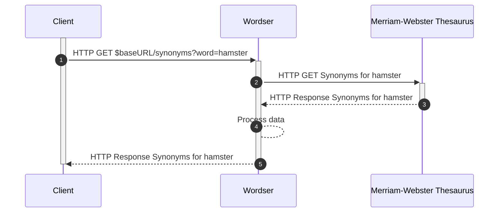

# Wordser Service

A rust service that provides text analysis features such as:  
    a. synonyms for a word using MERRIAM-WEBSTER'S COLLEGIATE® THESAURUS API  
    b. text summarization, sentiment analysis, keyword extraction, and token unmasking using this wonderful rust crate: https://github.com/guillaume-be/rust-bert  

## Getting Started

See the README in the project root. Wordser is run with docker and primarily accessed via wordser web. Any additional services can call wordser web by joining the docker network.

## API

### General
1. Wordser exposes HTTP endpoints that all use JSON content type.  
1. Wordser is accessible within the docker network defined in the [docker-compose](../docker-compose.yaml) file in the project root directory at port 8080.  
1. If you wish to access wordser without using Wordser Web then you must add your own application to the network mentioned above.  

### Endpoints
All endpoints use a $baseURL of `http://wordser:8080/api/v1`. For brevity, the $baseURL is implied below.  

1. GET /synonyms  
    a. Parameters: `word`(string)  
    b. Example URL: $baseURL/synonyms?word=hamster  
    c. Response:  
    ```
    {"synonyms": ["synonym1", "synonym2", ..., "synoym_x"]}
    ```

### Example Request Sequence




